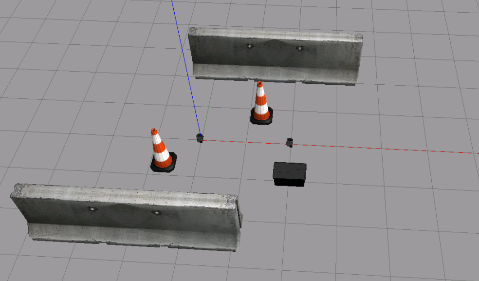

<h2 align="center"> :robot: Follow the leader </h2>

O projeto consiste no desafio de <i>Follow the Leader</i>, onde um dos robô é considerado o mestre, sendo controlado pelo <i>eleop</i>, e o outro robô deverá seguí-lo 
no mapa que possui obstáculos. A maneira como o mestre identifica os objetos que estão no mapa é pelo sensor LIDAR, o outro robô irá seguí-lo por conta da biblioteca que possui a técnica de Odometria.
_________________________________________________________________________________________________________________

<h3>:gear: Configurações iniciais </h3>

Foi utilizado o turtlebot3, de modo que foi usado os seguintes recursos dele, inseridos na pasta src:
```
$ git clone https://github.com/ROBOTIS-GIT/turtlebot3_msgs.git
$ git clone https://github.com/ROBOTIS-GIT/turtlebot3.git
$ git clone https://github.com/ROBOTIS-GIT/turtlebot3_simulations.git
```

Comandos feitos na pasta principal.

<br><br>Foi utilizado três terminais para poder enviar os comandos, que serão indicados por 1), 2) e 3).

<h3>1) Inicializando o master</h3>

```
roscore
```

<h3>:toolbox: Buildando e setando variáveis</h3>

```
catkin build
source devel/setup.bash
```
Segundo comando deverá ser executado em outros terminais, conforme mensagem de erro.

<h3>Definindo o robô que será utilizado</h3>

```
export TURTLEBOT3_MODEL=burger
```

<h3>2) Mapa Gazebo</h3>

O mapa foi criado utilizando alguns obstáculos, conforme imagem abaixo. 



Ele pode ser encontrado pelo caminho <i>src/follow_me/world/challenge.world</i> e para executá-lo foi declarado dentro do arquivo <i>two_tb3.launch</i>, da pasta <i>launch</i>, para que além do mapa, os dois turtlebot fossem inicilizados nas posições pré-determinadas.

```
roslaunch follow_node two_tb3.launch
```


<h3>3) Seguindo o mestre</h3>

Para que o seguidor possa inicializar seguindo o mestre, de suas posições iniciais, o seguinte comando é usado:

```
rosrun follow_me follower_node
```

<h3>:video_game: 4) Controlando o mestre</h3>
Pelo <i>teleop</i> é possível controlar o mestre pelo teclado.

```
rosrun turtlebot3_teleop turtlebot3_teleop_key
```
